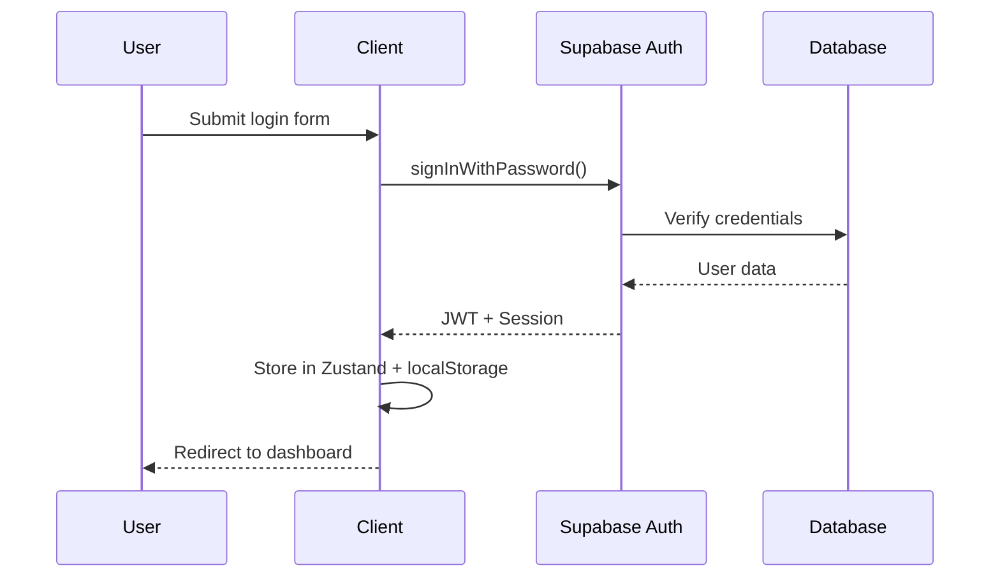

# Authentication System Guide

This guide covers the complete authentication system implementation using Supabase Auth, including user registration, login, session management, and security best practices.

## Overview

The authentication system provides:

- **User Registration** - Email/password signup with validation
- **User Login** - Secure authentication with session management
- **Password Management** - Reset, change, and recovery features
- **Session Handling** - Automatic token refresh and persistence
- **Role-Based Access** - User roles and permissions
- **Social Auth** - OAuth providers (optional)
- **Email Verification** - Account confirmation and security

## Architecture

### Auth Flow Diagram



## Authentication Store

### Zustand Auth Store

```typescript
// stores/auth.store.ts
import { create } from 'zustand';
import { persist, createJSONStorage } from 'zustand/middleware';
import { supabase } from '@/lib/supabase/client';

interface User {
  id: string;
  email: string;
  name?: string;
  avatar_url?: string;
  role: 'user' | 'admin' | 'moderator';
  email_verified: boolean;
  created_at: string;
  updated_at: string;
}

interface AuthState {
  // State
  user: User | null;
  session: any | null;
  loading: boolean;
  error: string | null;
  isAuthenticated: boolean;

  // Actions
  signUp: (email: string, password: string, metadata?: Record<string, any>) => Promise<void>;
  signIn: (email: string, password: string) => Promise<void>;
  signOut: () => Promise<void>;
  resetPassword: (email: string) => Promise<void>;
  updatePassword: (password: string) => Promise<void>;
  updateProfile: (updates: Partial<User>) => Promise<void>;
  verifyEmail: (token: string) => Promise<void>;
  resendVerification: () => Promise<void>;
  
  // Utility actions
  setUser: (user: User | null) => void;
  setSession: (session: any | null) => void;
  setLoading: (loading: boolean) => void;
  setError: (error: string | null) => void;
  clearError: () => void;
  refreshSession: () => Promise<void>;
}

export const useAuthStore = create<AuthState>()(
  persist(
    (set, get) => ({
      // Initial state
      user: null,
      session: null,
      loading: false,
      error: null,
      isAuthenticated: false,

      // Sign up with email and password
      signUp: async (email: string, password: string, metadata = {}) => {
        set({ loading: true, error: null });
        
        try {
          const { data, error } = await supabase.auth.signUp({
            email,
            password,
            options: {
              data: metadata,
            },
          });
          
          if (error) throw error;
          
          if (data.user && data.session) {
            set({
              user: transformUser(data.user),
              session: data.session,
              isAuthenticated: true,
              loading: false,
            });
          } else {
            // Email confirmation required
            set({
              loading: false,
              error: 'Please check your email to verify your account',
            });
          }
        } catch (error) {
          set({
            loading: false,
            error: error instanceof Error ? error.message : 'Sign up failed',
          });
          throw error;
        }
      },

      // Sign in with email and password
      signIn: async (email: string, password: string) => {
        set({ loading: true, error: null });
        
        try {
          const { data, error } = await supabase.auth.signInWithPassword({
            email,
            password,
          });
          
          if (error) throw error;
          
          set({
            user: transformUser(data.user),
            session: data.session,
            isAuthenticated: true,
            loading: false,
          });
        } catch (error) {
          set({
            loading: false,
            error: error instanceof Error ? error.message : 'Sign in failed',
          });
          throw error;
        }
      },

      // Sign out
      signOut: async () => {
        set({ loading: true });
        
        try {
          const { error } = await supabase.auth.signOut();
          
          if (error) throw error;
          
          set({
            user: null,
            session: null,
            isAuthenticated: false,
            loading: false,
            error: null,
          });
        } catch (error) {
          set({
            loading: false,
            error: error instanceof Error ? error.message : 'Sign out failed',
          });
        }
      },

      // Reset password
      resetPassword: async (email: string) => {
        set({ loading: true, error: null });
        
        try {
          const { error } = await supabase.auth.resetPasswordForEmail(email, {
            redirectTo: `${window.location.origin}/reset-password`,
          });
          
          if (error) throw error;
          
          set({ loading: false });
        } catch (error) {
          set({
            loading: false,
            error: error instanceof Error ? error.message : 'Password reset failed',
          });
          throw error;
        }
      },

      // Update password
      updatePassword: async (password: string) => {
        set({ loading: true, error: null });
        
        try {
          const { error } = await supabase.auth.updateUser({
            password,
          });
          
          if (error) throw error;
          
          set({ loading: false });
        } catch (error) {
          set({
            loading: false,
            error: error instanceof Error ? error.message : 'Password update failed',
          });
          throw error;
        }
      },

      // Update user profile
      updateProfile: async (updates: Partial<User>) => {
        set({ loading: true, error: null });
        
        try {
          const { data, error } = await supabase.auth.updateUser({
            data: updates,
          });
          
          if (error) throw error;
          
          const currentUser = get().user;
          if (currentUser) {
            set({
              user: { ...currentUser, ...updates },
              loading: false,
            });
          }
        } catch (error) {
          set({
            loading: false,
            error: error instanceof Error ? error.message : 'Profile update failed',
          });
          throw error;
        }
      },

      // Verify email
      verifyEmail: async (token: string) => {
        set({ loading: true, error: null });
        
        try {
          const { data, error } = await supabase.auth.verifyOtp({
            token_hash: token,
            type: 'email',
          });
          
          if (error) throw error;
          
          set({
            user: transformUser(data.user),
            session: data.session,
            isAuthenticated: true,
            loading: false,
          });
        } catch (error) {
          set({
            loading: false,
            error: error instanceof Error ? error.message : 'Email verification failed',
          });
          throw error;
        }
      },

      // Resend verification email
      resendVerification: async () => {
        const user = get().user;
        if (!user?.email) {
          throw new Error('No user email found');
        }
        
        set({ loading: true, error: null });
        
        try {
          const { error } = await supabase.auth.resend({
            type: 'signup',
            email: user.email,
          });
          
          if (error) throw error;
          
          set({ loading: false });
        } catch (error) {
          set({
            loading: false,
            error: error instanceof Error ? error.message : 'Resend verification failed',
          });
          throw error;
        }
      },

      // Refresh session
      refreshSession: async () => {
        try {
          const { data, error } = await supabase.auth.refreshSession();
          
          if (error) throw error;
          
          if (data.session) {
            set({
              session: data.session,
              user: transformUser(data.user),
              isAuthenticated: true,
            });
          }
        } catch (error) {
          console.error('Session refresh failed:', error);
          // Don't set error state for automatic refresh failures
        }
      },

      // Utility actions
      setUser: (user: User | null) => set({ user, isAuthenticated: !!user }),
      setSession: (session: any | null) => set({ session }),
      setLoading: (loading: boolean) => set({ loading }),
      setError: (error: string | null) => set({ error }),
      clearError: () => set({ error: null }),
    }),
    {
      name: 'auth-storage',
      storage: createJSONStorage(() => localStorage),
      partialize: (state) => ({
        user: state.user,
        session: state.session,
        isAuthenticated: state.isAuthenticated,
      }),
    }
  )
);

// Transform Supabase user to our User type
function transformUser(supabaseUser: any): User {
  return {
    id: supabaseUser.id,
    email: supabaseUser.email,
    name: supabaseUser.user_metadata?.name || supabaseUser.user_metadata?.full_name,
    avatar_url: supabaseUser.user_metadata?.avatar_url,
    role: supabaseUser.user_metadata?.role || 'user',
    email_verified: supabaseUser.email_confirmed_at != null,
    created_at: supabaseUser.created_at,
    updated_at: supabaseUser.updated_at,
  };
}

// Selectors for optimized subscriptions
export const selectUser = (state: AuthState) => state.user;
export const selectIsAuthenticated = (state: AuthState) => state.isAuthenticated;
export const selectAuthLoading = (state: AuthState) => state.loading;
export const selectAuthError = (state: AuthState) => state.error;
```

## Auth Session Management

### Session Provider

```typescript
// providers/auth-provider.tsx
'use client';

import { useEffect } from 'react';
import { useAuthStore } from '@/stores/auth.store';
import { supabase } from '@/lib/supabase/client';

interface AuthProviderProps {
  children: React.ReactNode;
}

export function AuthProvider({ children }: AuthProviderProps) {
  const { setUser, setSession, refreshSession } = useAuthStore();

  useEffect(() => {
    // Get initial session
    const getSession = async () => {
      const { data: { session }, error } = await supabase.auth.getSession();
      
      if (error) {
        console.error('Error getting session:', error);
        return;
      }
      
      if (session) {
        setSession(session);
        setUser(transformUser(session.user));
      }
    };

    getSession();

    // Listen for auth changes
    const { data: { subscription } } = supabase.auth.onAuthStateChange(
      async (event, session) => {
        console.log('Auth state changed:', event, session);
        
        switch (event) {
          case 'SIGNED_IN':
            setSession(session);
            setUser(session ? transformUser(session.user) : null);
            break;
          case 'SIGNED_OUT':
            setSession(null);
            setUser(null);
            break;
          case 'TOKEN_REFRESHED':
            setSession(session);
            break;
          case 'USER_UPDATED':
            if (session) {
              setUser(transformUser(session.user));
            }
            break;
        }
      }
    );

    // Set up automatic token refresh
    const refreshInterval = setInterval(() => {
      refreshSession();
    }, 30 * 60 * 1000); // Refresh every 30 minutes

    return () => {
      subscription.unsubscribe();
      clearInterval(refreshInterval);
    };
  }, [setUser, setSession, refreshSession]);

  return <>{children}</>;
}

// Use in app layout
export function RootLayout({ children }: { children: React.ReactNode }) {
  return (
    <html>
      <body>
        <AuthProvider>
          {children}
        </AuthProvider>
      </body>
    </html>
  );
}
```

## Form Components

### Login Form

```typescript
// components/forms/login-form.tsx
'use client';

import { useState } from 'react';
import { useRouter } from 'next/navigation';
import { useForm } from 'react-hook-form';
import { zodResolver } from '@hookform/resolvers/zod';
import { z } from 'zod';
import { Button } from '@/components/ui/button';
import { Input } from '@/components/ui/input';
import { Label } from '@/components/ui/label';
import { Alert, AlertDescription } from '@/components/ui/alert';
import { useAuthStore } from '@/stores/auth.store';
import { useToast } from '@/stores/ui.store';

const loginSchema = z.object({
  email: z.string().email('Invalid email address'),
  password: z.string().min(6, 'Password must be at least 6 characters'),
  rememberMe: z.boolean().default(false),
});

type LoginFormData = z.infer<typeof loginSchema>;

interface LoginFormProps {
  onSuccess?: () => void;
  className?: string;
}

export function LoginForm({ onSuccess, className }: LoginFormProps) {
  const router = useRouter();
  const toast = useToast();
  const { signIn, loading, error, clearError } = useAuthStore();
  
  const {
    register,
    handleSubmit,
    formState: { errors },
    setFocus,
  } = useForm<LoginFormData>({
    resolver: zodResolver(loginSchema),
    defaultValues: {
      rememberMe: false,
    },
  });

  const onSubmit = async (data: LoginFormData) => {
    clearError();
    
    try {
      await signIn(data.email, data.password);
      
      toast.success('Login successful', 'Welcome back!');
      
      if (onSuccess) {
        onSuccess();
      } else {
        router.push('/dashboard');
      }
    } catch (error) {
      // Error is handled by the store
      setFocus('password');
    }
  };

  const handleForgotPassword = () => {
    router.push('/forgot-password');
  };

  return (
    <div className={className}>
      <form onSubmit={handleSubmit(onSubmit)} className="space-y-4">
        {error && (
          <Alert variant="destructive">
            <AlertDescription>{error}</AlertDescription>
          </Alert>
        )}

        <div className="space-y-2">
          <Label htmlFor="email">Email</Label>
          <Input
            id="email"
            type="email"
            autoComplete="email"
            placeholder="Enter your email"
            {...register('email')}
            error={!!errors.email}
          />
          {errors.email && (
            <p className="text-sm text-destructive">{errors.email.message}</p>
          )}
        </div>

        <div className="space-y-2">
          <Label htmlFor="password">Password</Label>
          <Input
            id="password"
            type="password"
            autoComplete="current-password"
            placeholder="Enter your password"
            {...register('password')}
            error={!!errors.password}
          />
          {errors.password && (
            <p className="text-sm text-destructive">{errors.password.message}</p>
          )}
        </div>

        <div className="flex items-center justify-between">
          <div className="flex items-center space-x-2">
            <input
              id="rememberMe"
              type="checkbox"
              className="rounded border-gray-300"
              {...register('rememberMe')}
            />
            <Label htmlFor="rememberMe" className="text-sm">
              Remember me
            </Label>
          </div>

          <Button
            type="button"
            variant="link"
            size="sm"
            onClick={handleForgotPassword}
            className="px-0"
          >
            Forgot password?
          </Button>
        </div>

        <Button
          type="submit"
          className="w-full"
          disabled={loading}
        >
          {loading ? 'Signing in...' : 'Sign in'}
        </Button>
      </form>
    </div>
  );
}
```

### Signup Form

```typescript
// components/forms/signup-form.tsx
'use client';

import { useState } from 'react';
import { useRouter } from 'next/navigation';
import { useForm } from 'react-hook-form';
import { zodResolver } from '@hookform/resolvers/zod';
import { z } from 'zod';
import { Button } from '@/components/ui/button';
import { Input } from '@/components/ui/input';
import { Label } from '@/components/ui/label';
import { Alert, AlertDescription } from '@/components/ui/alert';
import { Checkbox } from '@/components/ui/checkbox';
import { useAuthStore } from '@/stores/auth.store';
import { useToast } from '@/stores/ui.store';

const signupSchema = z.object({
  name: z.string().min(2, 'Name must be at least 2 characters'),
  email: z.string().email('Invalid email address'),
  password: z.string()
    .min(8, 'Password must be at least 8 characters')
    .regex(/^(?=.*[a-z])(?=.*[A-Z])(?=.*\d)/, 'Password must contain uppercase, lowercase, and number'),
  confirmPassword: z.string(),
  acceptTerms: z.boolean().refine(val => val === true, 'You must accept the terms and conditions'),
}).refine(data => data.password === data.confirmPassword, {
  message: "Passwords don't match",
  path: ["confirmPassword"],
});

type SignupFormData = z.infer<typeof signupSchema>;

interface SignupFormProps {
  onSuccess?: () => void;
  className?: string;
}

export function SignupForm({ onSuccess, className }: SignupFormProps) {
  const router = useRouter();
  const toast = useToast();
  const { signUp, loading, error, clearError } = useAuthStore();
  
  const {
    register,
    handleSubmit,
    formState: { errors },
    setValue,
    watch,
  } = useForm<SignupFormData>({
    resolver: zodResolver(signupSchema),
  });

  const acceptTerms = watch('acceptTerms');

  const onSubmit = async (data: SignupFormData) => {
    clearError();
    
    try {
      await signUp(data.email, data.password, {
        name: data.name,
        full_name: data.name,
      });
      
      toast.success('Account created', 'Please check your email to verify your account');
      
      if (onSuccess) {
        onSuccess();
      } else {
        router.push('/verify-email');
      }
    } catch (error) {
      // Error is handled by the store
    }
  };

  return (
    <div className={className}>
      <form onSubmit={handleSubmit(onSubmit)} className="space-y-4">
        {error && (
          <Alert variant="destructive">
            <AlertDescription>{error}</AlertDescription>
          </Alert>
        )}

        <div className="space-y-2">
          <Label htmlFor="name">Full Name</Label>
          <Input
            id="name"
            type="text"
            autoComplete="name"
            placeholder="Enter your full name"
            {...register('name')}
            error={!!errors.name}
          />
          {errors.name && (
            <p className="text-sm text-destructive">{errors.name.message}</p>
          )}
        </div>

        <div className="space-y-2">
          <Label htmlFor="email">Email</Label>
          <Input
            id="email"
            type="email"
            autoComplete="email"
            placeholder="Enter your email"
            {...register('email')}
            error={!!errors.email}
          />
          {errors.email && (
            <p className="text-sm text-destructive">{errors.email.message}</p>
          )}
        </div>

        <div className="space-y-2">
          <Label htmlFor="password">Password</Label>
          <Input
            id="password"
            type="password"
            autoComplete="new-password"
            placeholder="Create a password"
            {...register('password')}
            error={!!errors.password}
          />
          {errors.password && (
            <p className="text-sm text-destructive">{errors.password.message}</p>
          )}
        </div>

        <div className="space-y-2">
          <Label htmlFor="confirmPassword">Confirm Password</Label>
          <Input
            id="confirmPassword"
            type="password"
            autoComplete="new-password"
            placeholder="Confirm your password"
            {...register('confirmPassword')}
            error={!!errors.confirmPassword}
          />
          {errors.confirmPassword && (
            <p className="text-sm text-destructive">{errors.confirmPassword.message}</p>
          )}
        </div>

        <div className="flex items-center space-x-2">
          <Checkbox
            id="acceptTerms"
            checked={acceptTerms}
            onCheckedChange={(checked) => setValue('acceptTerms', checked as boolean)}
          />
          <Label htmlFor="acceptTerms" className="text-sm">
            I accept the{' '}
            <a href="/terms" className="text-primary underline">
              terms and conditions
            </a>{' '}
            and{' '}
            <a href="/privacy" className="text-primary underline">
              privacy policy
            </a>
          </Label>
        </div>
        {errors.acceptTerms && (
          <p className="text-sm text-destructive">{errors.acceptTerms.message}</p>
        )}

        <Button
          type="submit"
          className="w-full"
          disabled={loading}
        >
          {loading ? 'Creating account...' : 'Create account'}
        </Button>
      </form>
    </div>
  );
}
```

## Route Protection

### Auth Guard Hook

```typescript
// hooks/use-auth-guard.ts
import { useEffect } from 'react';
import { useRouter } from 'next/navigation';
import { useAuthStore } from '@/stores/auth.store';

interface UseAuthGuardOptions {
  redirectTo?: string;
  requireAuth?: boolean;
  requiredRole?: string;
}

export function useAuthGuard({
  redirectTo = '/login',
  requireAuth = true,
  requiredRole,
}: UseAuthGuardOptions = {}) {
  const router = useRouter();
  const { user, isAuthenticated, loading } = useAuthStore();

  useEffect(() => {
    if (loading) return; // Wait for auth state to load

    if (requireAuth && !isAuthenticated) {
      router.push(redirectTo);
      return;
    }

    if (requiredRole && user?.role !== requiredRole) {
      router.push('/unauthorized');
      return;
    }
  }, [user, isAuthenticated, loading, router, redirectTo, requireAuth, requiredRole]);

  return {
    user,
    isAuthenticated,
    loading,
    hasRequiredRole: !requiredRole || user?.role === requiredRole,
  };
}
```

### Protected Route Component

```typescript
// components/auth/protected-route.tsx
'use client';

import { useAuthGuard } from '@/hooks/use-auth-guard';
import { LoadingSpinner } from '@/components/ui/loading';

interface ProtectedRouteProps {
  children: React.ReactNode;
  redirectTo?: string;
  requiredRole?: string;
  fallback?: React.ReactNode;
}

export function ProtectedRoute({
  children,
  redirectTo,
  requiredRole,
  fallback,
}: ProtectedRouteProps) {
  const { isAuthenticated, loading, hasRequiredRole } = useAuthGuard({
    redirectTo,
    requiredRole,
  });

  if (loading) {
    return fallback || (
      <div className="flex items-center justify-center min-h-screen">
        <LoadingSpinner size="lg" />
      </div>
    );
  }

  if (!isAuthenticated || !hasRequiredRole) {
    return fallback || null;
  }

  return <>{children}</>;
}
```

### Server-Side Route Protection

```typescript
// lib/auth/server.ts
import { createServerComponentClient } from '@supabase/auth-helpers-nextjs';
import { cookies } from 'next/headers';
import { redirect } from 'next/navigation';

export async function requireAuth() {
  const supabase = createServerComponentClient({ cookies });
  
  const { data: { session }, error } = await supabase.auth.getSession();
  
  if (error || !session) {
    redirect('/login');
  }
  
  return session;
}

export async function requireRole(requiredRole: string) {
  const session = await requireAuth();
  
  const userRole = session.user.user_metadata?.role || 'user';
  
  if (userRole !== requiredRole) {
    redirect('/unauthorized');
  }
  
  return session;
}

// Usage in server components
export default async function AdminPage() {
  await requireRole('admin');
  
  return <div>Admin content</div>;
}
```

## Middleware Configuration

### Auth Middleware

```typescript
// middleware.ts
import { createMiddlewareClient } from '@supabase/auth-helpers-nextjs';
import { NextResponse } from 'next/server';
import type { NextRequest } from 'next/server';

export async function middleware(req: NextRequest) {
  const res = NextResponse.next();
  const supabase = createMiddlewareClient({ req, res });

  // Refresh session if expired - required for Server Components
  const { data: { session } } = await supabase.auth.getSession();

  // Protected routes
  const protectedRoutes = ['/dashboard', '/profile', '/settings'];
  const adminRoutes = ['/admin'];
  
  const isProtectedRoute = protectedRoutes.some(route => 
    req.nextUrl.pathname.startsWith(route)
  );
  
  const isAdminRoute = adminRoutes.some(route => 
    req.nextUrl.pathname.startsWith(route)
  );

  // Redirect to login if not authenticated
  if (isProtectedRoute && !session) {
    return NextResponse.redirect(new URL('/login', req.url));
  }

  // Check admin role for admin routes
  if (isAdminRoute) {
    if (!session) {
      return NextResponse.redirect(new URL('/login', req.url));
    }
    
    const userRole = session.user.user_metadata?.role || 'user';
    if (userRole !== 'admin') {
      return NextResponse.redirect(new URL('/unauthorized', req.url));
    }
  }

  // Redirect authenticated users away from auth pages
  const authPages = ['/login', '/signup', '/forgot-password'];
  const isAuthPage = authPages.includes(req.nextUrl.pathname);
  
  if (isAuthPage && session) {
    return NextResponse.redirect(new URL('/dashboard', req.url));
  }

  return res;
}

export const config = {
  matcher: [
    '/((?!_next/static|_next/image|favicon.ico|.*\\.(?:svg|png|jpg|jpeg|gif|webp)$).*)',
  ],
};
```

## Email Templates

### Welcome Email

```html
<!-- email-templates/welcome.html -->
<!DOCTYPE html>
<html>
<head>
  <meta charset="utf-8">
  <title>Welcome to {{ .SiteName }}</title>
</head>
<body style="font-family: Arial, sans-serif; max-width: 600px; margin: 0 auto;">
  <div style="background: #f8f9fa; padding: 20px; text-align: center;">
    <h1 style="color: #333;">Welcome to {{ .SiteName }}!</h1>
  </div>
  
  <div style="padding: 20px;">
    <p>Hi {{ .UserName }},</p>
    
    <p>Welcome to {{ .SiteName }}! We're excited to have you on board.</p>
    
    <p>To get started, please verify your email address by clicking the button below:</p>
    
    <div style="text-align: center; margin: 30px 0;">
      <a href="{{ .ConfirmationURL }}" 
         style="background: #0066cc; color: white; padding: 12px 24px; 
                text-decoration: none; border-radius: 5px; display: inline-block;">
        Verify Email Address
      </a>
    </div>
    
    <p>If you didn't create an account, you can safely ignore this email.</p>
    
    <p>Best regards,<br>The {{ .SiteName }} Team</p>
  </div>
  
  <div style="background: #f8f9fa; padding: 20px; text-align: center; color: #666;">
    <p style="margin: 0;">
      <a href="{{ .SiteURL }}">{{ .SiteName }}</a> | 
      <a href="{{ .SiteURL }}/support">Support</a> | 
      <a href="{{ .SiteURL }}/unsubscribe">Unsubscribe</a>
    </p>
  </div>
</body>
</html>
```

### Password Reset Email

```html
<!-- email-templates/reset-password.html -->
<!DOCTYPE html>
<html>
<head>
  <meta charset="utf-8">
  <title>Reset Your Password</title>
</head>
<body style="font-family: Arial, sans-serif; max-width: 600px; margin: 0 auto;">
  <div style="background: #f8f9fa; padding: 20px; text-align: center;">
    <h1 style="color: #333;">Reset Your Password</h1>
  </div>
  
  <div style="padding: 20px;">
    <p>Hi {{ .UserName }},</p>
    
    <p>You requested to reset your password for your {{ .SiteName }} account.</p>
    
    <p>Click the button below to reset your password:</p>
    
    <div style="text-align: center; margin: 30px 0;">
      <a href="{{ .ResetURL }}" 
         style="background: #dc3545; color: white; padding: 12px 24px; 
                text-decoration: none; border-radius: 5px; display: inline-block;">
        Reset Password
      </a>
    </div>
    
    <p><strong>This link will expire in 1 hour.</strong></p>
    
    <p>If you didn't request a password reset, you can safely ignore this email.</p>
    
    <p>Best regards,<br>The {{ .SiteName }} Team</p>
  </div>
</body>
</html>
```

## Testing Authentication

### Auth Store Tests

```typescript
// stores/__tests__/auth.store.test.ts
import { renderHook, act } from '@testing-library/react';
import { useAuthStore } from '../auth.store';

// Mock Supabase
jest.mock('@/lib/supabase/client', () => ({
  supabase: {
    auth: {
      signInWithPassword: jest.fn(),
      signUp: jest.fn(),
      signOut: jest.fn(),
      resetPasswordForEmail: jest.fn(),
      updateUser: jest.fn(),
    },
  },
}));

describe('Auth Store', () => {
  beforeEach(() => {
    // Reset store state
    useAuthStore.setState({
      user: null,
      session: null,
      loading: false,
      error: null,
      isAuthenticated: false,
    });
  });

  it('should sign in successfully', async () => {
    const mockUser = { id: '1', email: 'test@example.com' };
    const mockSession = { user: mockUser };
    
    require('@/lib/supabase/client').supabase.auth.signInWithPassword
      .mockResolvedValue({
        data: { user: mockUser, session: mockSession },
        error: null,
      });

    const { result } = renderHook(() => useAuthStore());

    await act(async () => {
      await result.current.signIn('test@example.com', 'password');
    });

    expect(result.current.isAuthenticated).toBe(true);
    expect(result.current.user?.email).toBe('test@example.com');
    expect(result.current.error).toBeNull();
  });

  it('should handle sign in error', async () => {
    require('@/lib/supabase/client').supabase.auth.signInWithPassword
      .mockResolvedValue({
        data: null,
        error: { message: 'Invalid credentials' },
      });

    const { result } = renderHook(() => useAuthStore());

    await act(async () => {
      try {
        await result.current.signIn('test@example.com', 'wrong-password');
      } catch (error) {
        // Expected to throw
      }
    });

    expect(result.current.isAuthenticated).toBe(false);
    expect(result.current.error).toBe('Invalid credentials');
  });
});
```

### Login Form Tests

```typescript
// components/forms/__tests__/login-form.test.tsx
import { render, screen, fireEvent, waitFor } from '@testing-library/react';
import userEvent from '@testing-library/user-event';
import { LoginForm } from '../login-form';

// Mock store
const mockSignIn = jest.fn();
jest.mock('@/stores/auth.store', () => ({
  useAuthStore: () => ({
    signIn: mockSignIn,
    loading: false,
    error: null,
    clearError: jest.fn(),
  }),
}));

// Mock router
jest.mock('next/navigation', () => ({
  useRouter: () => ({
    push: jest.fn(),
  }),
}));

describe('LoginForm', () => {
  beforeEach(() => {
    jest.clearAllMocks();
  });

  it('renders form fields', () => {
    render(<LoginForm />);
    
    expect(screen.getByLabelText('Email')).toBeInTheDocument();
    expect(screen.getByLabelText('Password')).toBeInTheDocument();
    expect(screen.getByRole('button', { name: 'Sign in' })).toBeInTheDocument();
  });

  it('validates required fields', async () => {
    const user = userEvent.setup();
    render(<LoginForm />);
    
    const submitButton = screen.getByRole('button', { name: 'Sign in' });
    await user.click(submitButton);
    
    await waitFor(() => {
      expect(screen.getByText('Invalid email address')).toBeInTheDocument();
      expect(screen.getByText('Password must be at least 6 characters')).toBeInTheDocument();
    });
  });

  it('submits form with valid data', async () => {
    const user = userEvent.setup();
    mockSignIn.mockResolvedValue(undefined);
    
    render(<LoginForm />);
    
    await user.type(screen.getByLabelText('Email'), 'test@example.com');
    await user.type(screen.getByLabelText('Password'), 'password123');
    await user.click(screen.getByRole('button', { name: 'Sign in' }));
    
    await waitFor(() => {
      expect(mockSignIn).toHaveBeenCalledWith('test@example.com', 'password123');
    });
  });
});
```

## Security Best Practices

### 1. Password Requirements

- Minimum 8 characters
- Must contain uppercase, lowercase, and number
- Optional special character requirement
- Password strength indicator

### 2. Session Security

```typescript
// lib/auth/security.ts
export const SESSION_CONFIG = {
  // Session timeout (24 hours)
  SESSION_TIMEOUT: 24 * 60 * 60 * 1000,
  
  // Refresh token before expiry
  REFRESH_THRESHOLD: 5 * 60 * 1000, // 5 minutes
  
  // Maximum concurrent sessions
  MAX_SESSIONS: 3,
  
  // Password complexity
  PASSWORD_MIN_LENGTH: 8,
  PASSWORD_REGEX: /^(?=.*[a-z])(?=.*[A-Z])(?=.*\d)(?=.*[@$!%*?&])[A-Za-z\d@$!%*?&]/,
};

export function validatePassword(password: string): boolean {
  return (
    password.length >= SESSION_CONFIG.PASSWORD_MIN_LENGTH &&
    SESSION_CONFIG.PASSWORD_REGEX.test(password)
  );
}

export function isSessionExpired(session: any): boolean {
  if (!session?.expires_at) return true;
  
  const expiryTime = new Date(session.expires_at).getTime();
  const now = Date.now();
  
  return now >= expiryTime;
}

export function shouldRefreshSession(session: any): boolean {
  if (!session?.expires_at) return false;
  
  const expiryTime = new Date(session.expires_at).getTime();
  const now = Date.now();
  
  return (expiryTime - now) <= SESSION_CONFIG.REFRESH_THRESHOLD;
}
```

### 3. Rate Limiting

```typescript
// lib/auth/rate-limit.ts
interface RateLimitConfig {
  windowMs: number;
  maxAttempts: number;
  blockDuration: number;
}

class RateLimiter {
  private attempts: Map<string, number[]> = new Map();
  private blocked: Map<string, number> = new Map();

  isBlocked(identifier: string, config: RateLimitConfig): boolean {
    const blockUntil = this.blocked.get(identifier);
    if (blockUntil && Date.now() < blockUntil) {
      return true;
    }
    
    if (blockUntil) {
      this.blocked.delete(identifier);
    }
    
    return false;
  }

  recordAttempt(identifier: string, config: RateLimitConfig): boolean {
    if (this.isBlocked(identifier, config)) {
      return false;
    }

    const now = Date.now();
    const attempts = this.attempts.get(identifier) || [];
    
    // Remove old attempts outside the window
    const recentAttempts = attempts.filter(
      timestamp => now - timestamp < config.windowMs
    );
    
    recentAttempts.push(now);
    this.attempts.set(identifier, recentAttempts);
    
    if (recentAttempts.length >= config.maxAttempts) {
      this.blocked.set(identifier, now + config.blockDuration);
      return false;
    }
    
    return true;
  }
}

export const authRateLimiter = new RateLimiter();

export const AUTH_RATE_LIMITS = {
  LOGIN: {
    windowMs: 15 * 60 * 1000, // 15 minutes
    maxAttempts: 5,
    blockDuration: 30 * 60 * 1000, // 30 minutes
  },
  SIGNUP: {
    windowMs: 60 * 60 * 1000, // 1 hour
    maxAttempts: 3,
    blockDuration: 60 * 60 * 1000, // 1 hour
  },
  PASSWORD_RESET: {
    windowMs: 60 * 60 * 1000, // 1 hour
    maxAttempts: 3,
    blockDuration: 60 * 60 * 1000, // 1 hour
  },
};
```

### 4. CSRF Protection

```typescript
// lib/auth/csrf.ts
import { randomBytes } from 'crypto';

export function generateCSRFToken(): string {
  return randomBytes(32).toString('hex');
}

export function validateCSRFToken(token: string, storedToken: string): boolean {
  if (!token || !storedToken) return false;
  
  // Use crypto.timingSafeEqual in production
  return token === storedToken;
}

// Usage in forms
export function useCSRFToken() {
  const [token, setToken] = useState<string>('');
  
  useEffect(() => {
    setToken(generateCSRFToken());
  }, []);
  
  return token;
}
```

## Troubleshooting

### Common Issues

1. **Session not persisting**
   - Check localStorage permissions
   - Verify domain configuration
   - Check for multiple auth providers

2. **Email verification not working**
   - Check email template configuration
   - Verify redirect URLs
   - Check spam folder

3. **Infinite redirect loops**
   - Check middleware configuration
   - Verify protected route logic
   - Check authentication state timing

4. **Token refresh failures**
   - Check network connectivity
   - Verify Supabase configuration
   - Check token expiry settings

### Debug Mode

```typescript
// Enable auth debugging
if (process.env.NODE_ENV === 'development') {
  supabase.auth.debug = true;
}

// Log auth state changes
supabase.auth.onAuthStateChange((event, session) => {
  console.log('Auth Debug:', {
    event,
    user: session?.user?.id,
    expires: session?.expires_at,
    timestamp: new Date().toISOString(),
  });
});
```

---

**Last Updated**: {{ new Date().toLocaleDateString('en-GB') }}

For more authentication patterns and security best practices, refer to the [Supabase Auth Documentation](https://supabase.com/docs/guides/auth).
